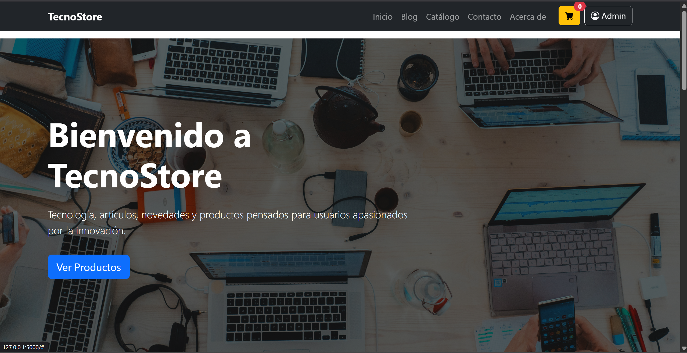
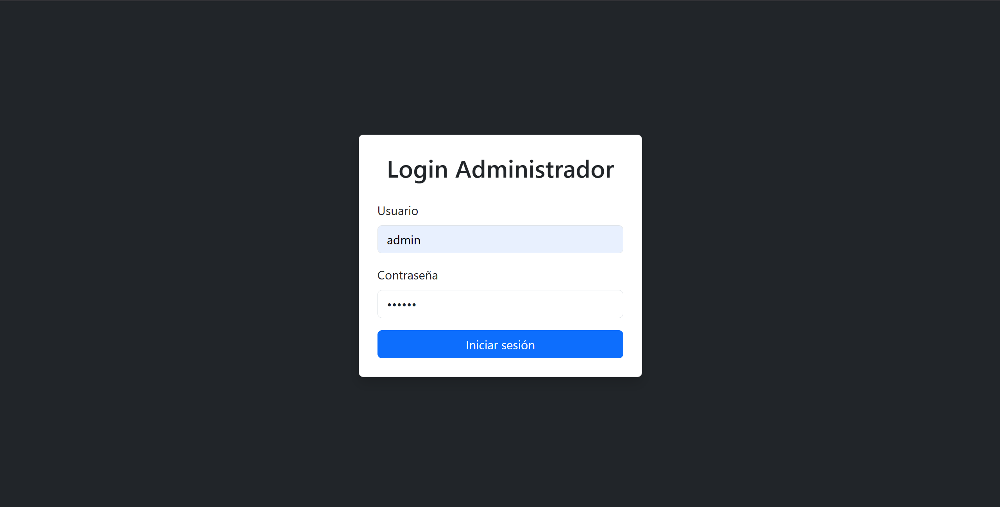
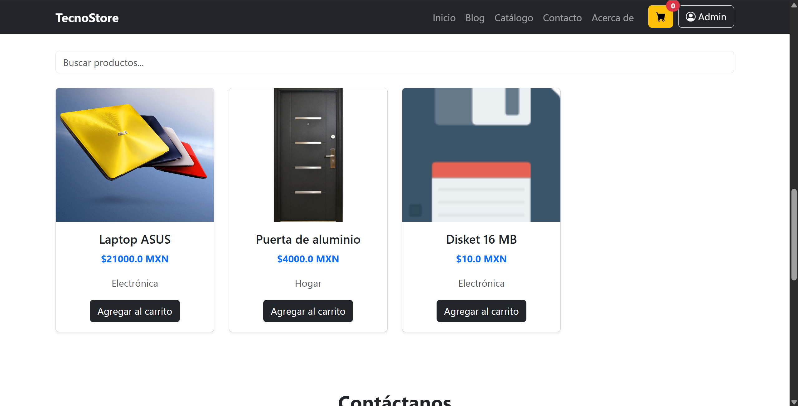
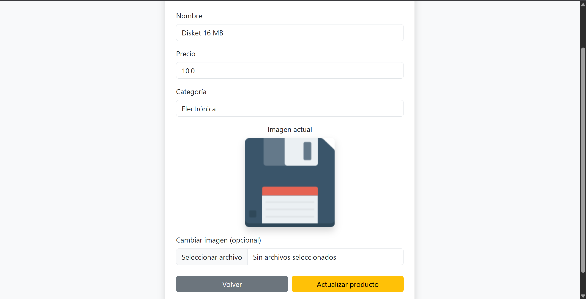

# TecnoStore Blog

Aplicación web desarrollada con Flask, SQLite, Bootstrap y JavaScript para la administración y visualización de productos tecnológicos.

---

## Vista previa

### Página principal


### Panel administrador


### Agregar productos


### Login


---

## Características

- Sistema de login para administrador
- Panel administrativo
- CRUD completo de productos
- Subida de imágenes
- Carrito de compras
- Diseño responsive
- Base de datos SQLite
- Interfaz moderna con Bootstrap 5
- Integración con GitHub

---

## Tecnologías utilizadas

| Tecnología | Uso |
|---|---|
| Python | Backend |
| Flask | Framework web |
| SQLite | Base de datos |
| Bootstrap 5 | Diseño responsive |
| HTML5 | Estructura |
| CSS3 | Estilos |
| JavaScript | Interactividad |
| Git | Control de versiones |
| GitHub | Repositorio remoto |

---

## Estructura del proyecto

```bash
technostore-blog/
│
├── app.py
├── database.db
├── schema.sql
├── crear_admin.py
├── init_db.py
│
├── static/
│   ├── css/
│   ├── js/
│   ├── uploads/
│   └── screenshots/
│
├── templates/
│   ├── index.html
│   ├── login.html
│   ├── admin.html
│   ├── agregar_producto.html
│   └── editar_producto.html
│
└── README.md
```

---

## Instalación

### 1. Clonar repositorio

```bash
git clone https://github.com/Diwincraft/technostore-blog.git
```

---

### 2. Entrar al proyecto

```bash
cd technostore-blog
```

---

### 3. Crear entorno virtual

```bash
python -m venv venv
```

---

### 4. Activar entorno virtual

#### Windows

```bash
venv\Scripts\activate
```

#### Linux / Mac

```bash
source venv/bin/activate
```

---

### 5. Instalar dependencias

```bash
pip install flask werkzeug
```

---

### 6. Inicializar base de datos

```bash
python init_db.py
```

---

### 7. Crear usuario administrador

```bash
python crear_admin.py
```

---

### 8. Ejecutar proyecto

```bash
python app.py
```

---

## Acceso administrador

| Campo | Valor |
|---|---|
| Usuario | admin |
| Contraseña | 123456 |

---

## Funcionalidades principales

### Sistema de autenticación

- Inicio de sesión seguro
- Hash de contraseñas
- Protección de rutas

### Gestión de productos

- Crear productos
- Editar productos
- Eliminar productos
- Subida de imágenes

### Catálogo dinámico

- Productos cargados desde SQLite
- Renderizado dinámico con Jinja2
- Interfaz responsive

### Carrito de compras

- Agregar productos
- Contador dinámico
- Total de compra

---

## Capturas del sistema

### Home



### Login



### Dashboard



### Editar productos



---

## Mejoras futuras

- Sistema de pagos
- Roles de usuario
- API REST
- Panel estadístico
- Dashboard avanzado
- Dark Mode
- Búsqueda avanzada
- Categorías dinámicas

---

## Autor

**Omar Rivera Peralta**

Estudiante de Ingeniería en Sistemas Computacionales.

---

## Licencia

Proyecto desarrollado con fines académicos y educativos.