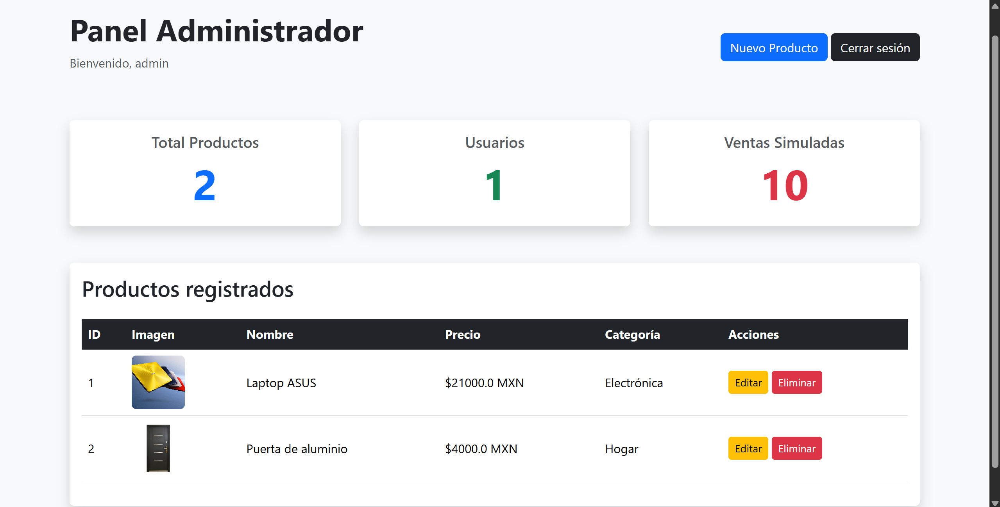
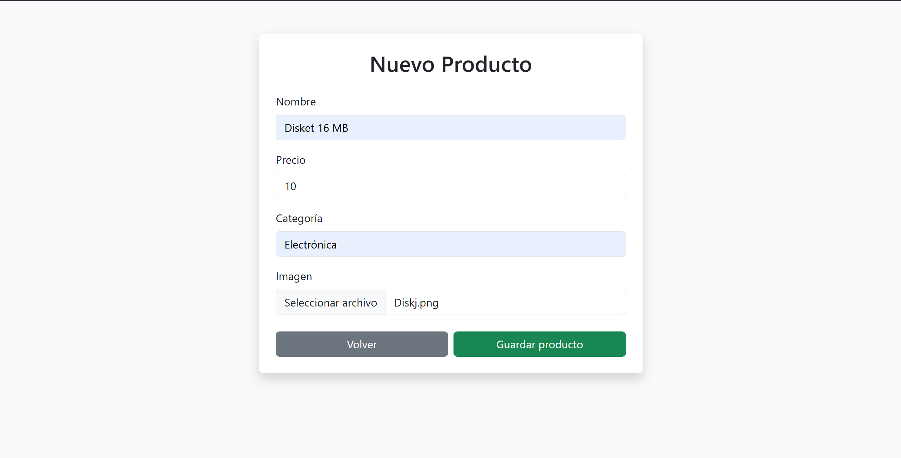

# TecnoStore FullStack

Sistema web Full Stack desarrollado con Flask, SQLite, Bootstrap y JavaScript para la administración y visualización de productos tecnológicos.

---

## Tecnologías

- Python
- Flask
- SQLite
- Bootstrap 5
- JavaScript
- HTML5
- CSS3
- Git & GitHub

---

## Características

✅ Login administrador  
✅ CRUD de productos  
✅ Subida de imágenes  
✅ Carrito de compras  
✅ Panel administrativo  
✅ Base de datos SQLite  
✅ Diseño responsive  

---

## Capturas

### Página principal


### Login administrador


### Panel administrador



### Agregar producto



---

## Instalación

### Clonar repositorio

```bash
git clone https://github.com/Diwincraft/tecnostore-fullstack.git
```

### Entrar al proyecto

```bash
cd tecnostore-fullstack
```

### Instalar Flask

```bash
pip install flask
```

### Ejecutar proyecto

```bash
python app.py
```

---

## Credenciales

| Usuario | Contraseña |
|---|---|
| admin | 123456 |

---

## Autor

**Omar Rivera Peralta**  
Estudiante de Ingeniería en Sistemas Computacionales.